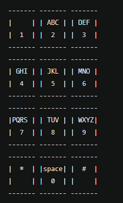

Prior to having fancy iPhones, teenagers would wear out their thumbs sending SMS messages on candybar-shaped feature phones with 3x4 numeric keypads.



r to the development of T9 systems (predictive text entry), the method to type words was called "multi-tap" and involved pressing a button repeatedly to cycle through all its possible values, in order. For example:

Pressing the button 7 repeatedly will cycle through the letters P -> Q -> R -> S -> 7 -> P -> ....
Pressing the button 0 is cycling through SPACE -> 0 -> SPACE -> 0 -> ....
Buttons with a single symbol on it just type this symbol.
A character is "locked in" and inserted into the message once the user presses a different key or pauses for a short period of time (thus, no extra button presses are required beyond what is needed for each letter individually). For example:

To type a letter "R" you would press the 7 key three times (as the screen display for the current character cycles through P->Q->R->S->7).
To type in a digit 3, you would press the button 3 four times.
To type in the message "ABC", you would press the button 2 once, wait a second, then press the button 2 twice to enter the letter B, then pause for another second, and press the button 2 three times, to enter the letter C. You would have to press the button 2 six times in total.
In order to send the message "WHERE DO U WANT 2 MEET L8R" a teen would have to actually do 47 button presses. No wonder they abbreviated...

For this assignment, write code that can calculate the amount of button presses required for any phrase, with the following requirements:

Punctuation can be ignored for this exercise.
Likewise, the phone doesn't distinguish between upper and lowercase characters (but you should allow your module to accept input in either form, for convenience).
Tested phrases contain letters (A-Z and a-z), digits (0-9), and special characters # and \*.

## Excersice

`embed:index.js`

## Sample Test

```jsx
import React from "react"
import Button from "@material-ui/core/Button"

function OutlinedButtons() {
  return (
    <>
      <Button variant="outlined">Default</Button>
      <Button variant="outlined" color="primary">
        Primary
      </Button>
      <Button variant="outlined" color="secondary">
        Secondary
      </Button>
      <Button variant="outlined" disabled>
        Disabled
      </Button>
      <Button variant="outlined" href="#outlined-buttons">
        Link
      </Button>
    </>
  )
}

// Demos must be default exported
export default OutlinedButtons
```
